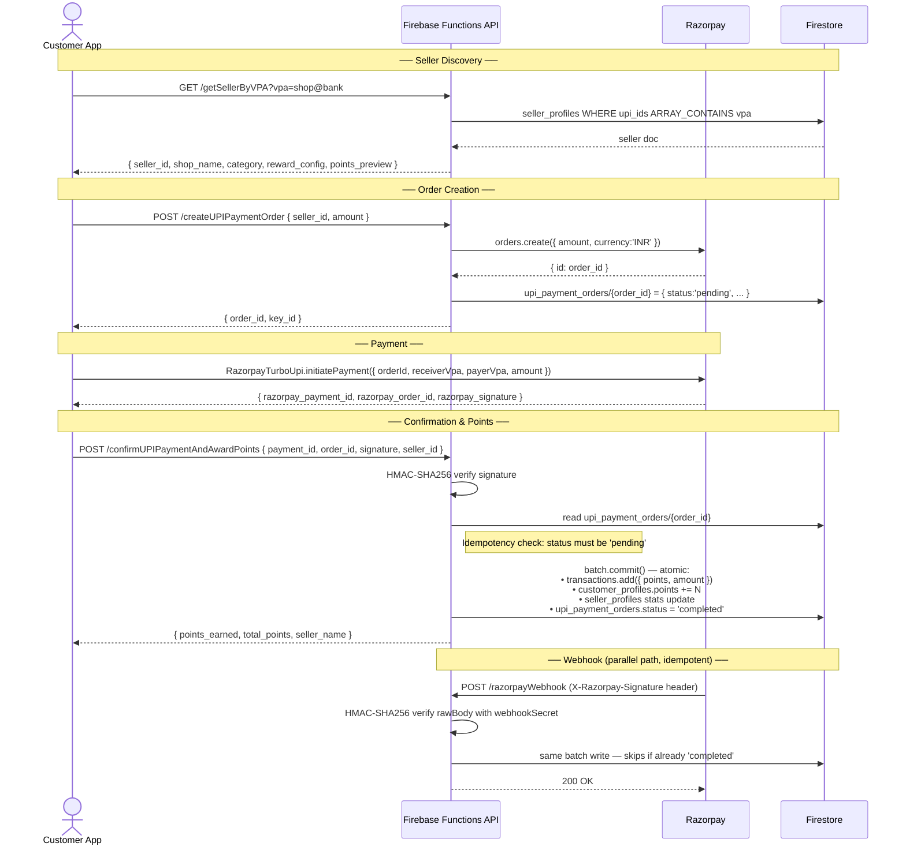
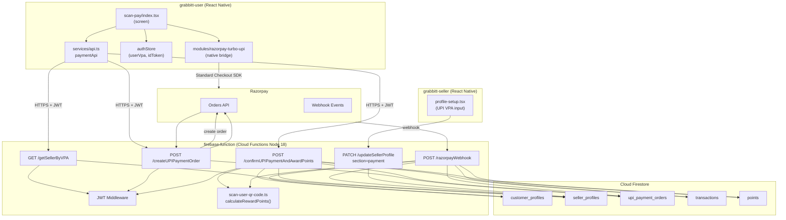
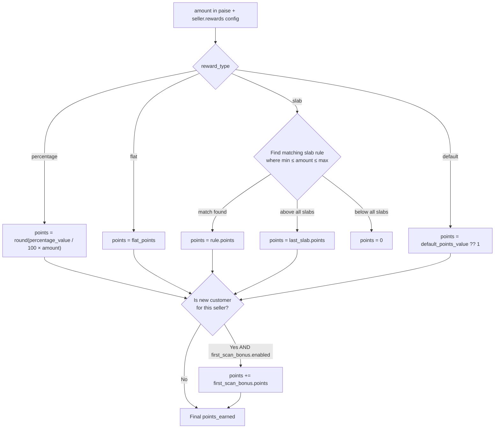
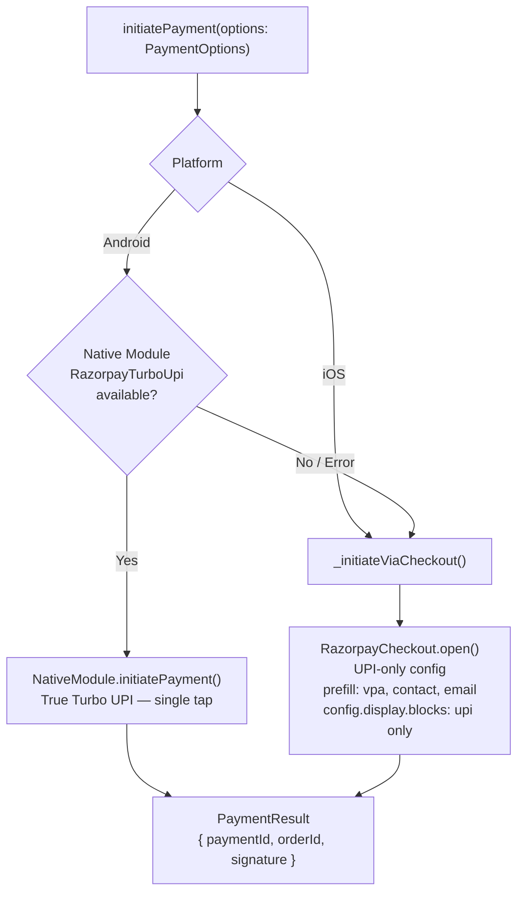

# Turbo UPI — Architecture & Flow Documentation

Turbo UPI is a Scan & Pay feature that lets customers scan any seller's standard UPI QR code with the Grabbitt app, pay via Razorpay, and automatically earn loyalty points — no separate QR code needed.

---

## Table of Contents

1. [Feature Overview](#1-feature-overview)
2. [Functional User Journey](#2-functional-user-journey)
3. [End-to-End Sequence Diagram](#3-end-to-end-sequence-diagram)
4. [System Architecture](#4-system-architecture)
5. [Module Structure](#5-module-structure)
6. [Firestore Data Model](#6-firestore-data-model)
7. [Points Calculation Logic](#7-points-calculation-logic)
8. [Native Module Bridge](#8-native-module-bridge--razorpay-sdk)
9. [Implementation Status](#9-implementation-status)

---

## 1. Feature Overview

```
┌─────────────────────────────────────────────────────────────┐
│                     TURBO UPI FLOW                           │
│                                                              │
│  Customer scans seller's UPI QR  →  Pays via Razorpay UPI  │
│  →  Backend verifies signature  →  Points auto-awarded       │
│                                                              │
│  No separate Grabbitt QR to generate.                        │
│  Works with any existing UPI QR the seller already has.      │
└─────────────────────────────────────────────────────────────┘
```

**Key difference from existing flow:**

| Existing QR Scan Flow | Turbo UPI Flow |
|---|---|
| Seller scans customer's Grabbitt QR | Customer scans seller's UPI QR |
| No payment involved | Payment + points in one step |
| Seller-initiated | Customer-initiated |
| Seller must have the Grabbitt app open | Seller doesn't need to do anything |

---

## 2. Functional User Journey

### 2a. Seller Onboarding (one-time)

```mermaid
flowchart TD
    A([Seller opens Profile Setup]) --> B{UPI VPA already\nregistered?}
    B -- Yes --> C([Done — visible in UPI Address card])
    B -- No --> D[Taps Edit on UPI Address card]
    D --> E[Enters VPA e.g. shop@okaxis]
    E --> F{Format valid?\nContains '@'}
    F -- No --> G[Alert: Enter a valid UPI VPA]
    G --> E
    F -- Yes --> H[PATCH /updateSellerProfile\nsection: 'payment'\ndata: { upi_vpa }]
    H --> I[(Firestore: seller_profiles.upi_ids[] updated)]
    I --> J([Alert: UPI address saved])
```

### 2b. Customer Registration of UPI VPA (one-time)

```mermaid
flowchart TD
    A([Customer navigates to Profile]) --> B[Opens Account Information]
    B --> C[Enters their UPI VPA]
    C --> D[PATCH /updateUserProfile\nsection: 'payment'\ndata: { upi_vpa }]
    D --> E[(Firestore: customer_profiles.upi_vpa = vpa)]
    E --> F[authStore.userVpa updated in memory]
    F --> G([Scan & Pay now unlocked])
```

### 2c. Scan & Pay — Customer Payment Flow

```mermaid
flowchart TD
    A([Customer opens Scan & Pay]) --> B{userVpa\nregistered?}
    B -- No --> C[Alert: Set up UPI first]
    C --> D([Redirected to Profile])
    B -- Yes --> E[Camera opens]
    E --> F[Customer points camera\nat seller's UPI QR sticker]
    F --> G{QR detected\nand valid UPI format?}
    G -- No --> E
    G -- Yes --> H[Extract VPA from QR\ne.g. cafebrew@okaxis]
    H --> I[GET /getSellerByVPA?vpa=...]
    I --> J{Seller found\non Grabbitt?}
    J -- No --> K[Alert: Seller not on Grabbitt\nRescan or close]
    J -- Yes --> L[Show Seller Confirmation Card\nshop_name, category, points_preview]
    L --> M[Customer enters / confirms amount]
    M --> N[POST /createUPIPaymentOrder\nseller_id, amount in paise]
    N --> O[(Firestore: upi_payment_orders/{id}\nstatus: 'pending')]
    O --> P[Launch Razorpay UPI SDK\nwith orderId + receiverVpa]
    P --> Q{Payment outcome}
    Q -- Cancelled --> R([Back to scanner])
    Q -- Failed --> S[Alert: Payment Failed]
    Q -- Success --> T[Receive paymentId, orderId, signature]
    T --> U[POST /confirmUPIPaymentAndAwardPoints]
    U --> V{Signature\nHMAC valid?}
    V -- No --> W[400: Invalid signature]
    V -- Yes --> X{Order status\n== pending?}
    X -- Already processed --> Y[409: Already processed]
    X -- Yes --> Z[Atomic batch write:\n• Create transaction doc\n• Increment user points\n• Update seller stats\n• Order status = completed]
    Z --> AA([Success screen: points_earned shown])
```

---

## 3. End-to-End Sequence Diagram



---

## 4. System Architecture



---

## 5. Module Structure

```
firebase-function/functions/src/
├── modules/
│   ├── seller/
│   │   ├── update-seller.ts          ✅ updated — handles section:'payment' → writes upi_ids[]
│   │   └── getSellerByVPA.ts         🔲 pending
│   ├── upi/                          🔲 pending (directory doesn't exist yet)
│   │   ├── createUPIPaymentOrder.ts  🔲 pending
│   │   ├── confirmUPIPaymentAndAwardPoints.ts  🔲 pending
│   │   └── razorpayWebhook.ts        🔲 pending
│   ├── qr-code/
│   │   └── scan-user-qr-code.ts     ✅ calculateRewardPoints() — reused by confirmUPI + webhook
│   └── payments/
│       ├── createOrder.ts            ✅ Razorpay order creation pattern — reused
│       └── verifyPayment.ts          ✅ HMAC-SHA256 pattern — reused
└── app.ts                            🔲 pending — new route registrations

grabbitt-user/
├── app/(drawer)/scan-pay/
│   └── index.tsx                     ✅ complete — full Scan & Pay screen
├── modules/razorpay-turbo-upi/
│   ├── index.ts                      ✅ exports initiatePayment
│   ├── src/
│   │   ├── RazorpayTurboUpi.ts       ✅ Android native → fallback to checkout
│   │   └── RazorpayTurboUpi.types.ts ✅ PaymentOptions, PaymentResult, PaymentErrorCode
│   ├── android/
│   │   ├── build.gradle              ✅
│   │   └── src/.../RazorpayTurboUpiModule.kt  ✅
│   ├── ios/
│   │   ├── RazorpayTurboUpi.podspec  ✅
│   │   └── RazorpayTurboUpiModule.swift       ✅
│   └── app-plugin.js                 ✅
├── services/api.ts                   ✅ paymentApi.getSellerByVPA / createUPIOrder / confirmUPIPayment
├── store/authStore.ts                ✅ userVpa state, hydrated on startup
└── types/
    ├── auth.ts                       ✅ UserProfile.upi_vpa added
    ├── upi.ts                        ✅ UPIPaymentOrder, CreateUPIOrderResponse, PaymentConfirmation, SellerByVPAResponse
    └── index.ts                      ✅ re-exports upi types

grabbitt-seller/
└── app/(drawer)/
    └── profile-setup.tsx             ✅ UPI VPA input card — saves via PATCH /updateSellerProfile
```

---

## 6. Firestore Data Model

```
seller_profiles/{seller_id}
├── business.shop_name
├── business.category
├── rewards
│   ├── reward_type         "percentage" | "flat" | "slab" | "default"
│   ├── percentage_value    (if type = percentage)
│   ├── flat_points         (if type = flat)
│   ├── slab_rules[]        (if type = slab)
│   │   └── { min, max, points }
│   ├── first_scan_bonus.enabled
│   ├── first_scan_bonus.points
│   └── upi_ids[]           ← VPAs registered by seller (e.g. ["shop@okaxis"])
└── stats
    ├── total_scans
    ├── total_points_distributed
    └── monthly_scans.{year}.{MON}

customer_profiles/{user_id}
├── account.name
├── account.phone
├── account.email
├── upi_vpa                 ← customer's registered VPA (e.g. "user@ybl")
└── stats.loyalty_points

upi_payment_orders/{razorpay_order_id}
├── user_id
├── seller_id
├── amount                  (in paise)
├── status                  "pending" → "completed" | "failed"
├── created_at
└── completed_at

transactions/{doc_id}
├── user_id
├── seller_id
├── seller_name
├── customer_name
├── points                  (total including bonus)
├── base_points
├── bonus_points
├── transaction_type        "earn"
├── qr_type                 "upi"   ← distinguishes from QR scan flow
├── amount                  (in paise)
└── timestamp

points/{doc_id}
├── user_id
├── seller_id
└── points                  (running total per user per seller)
```

---

## 7. Points Calculation Logic

The same `calculateRewardPoints()` function from `scan-user-qr-code.ts` is reused for both flows.



---

## 8. Native Module Bridge — Razorpay SDK

The `modules/razorpay-turbo-upi` package abstracts the payment step:



**`PaymentOptions` shape:**
```typescript
{
  receiverVpa: string   // seller's VPA from QR scan
  payerVpa: string      // user's registered UPI VPA
  amount: number        // in paise
  orderId: string       // Razorpay order ID from /createUPIPaymentOrder
  razorpayKey: string   // key_id from /createUPIPaymentOrder response
  description?: string
  contact?: string      // prefilled from user profile
  email?: string        // prefilled from user profile
}
```

---

## 9. Implementation Status

### Backend — `firebase-function`

| Component | File | Status |
|---|---|---|
| Seller UPI VPA save | `modules/seller/update-seller.ts` | ✅ Done |
| Seller lookup by VPA | `modules/seller/getSellerByVPA.ts` | 🔲 Pending |
| UPI order creation | `modules/upi/createUPIPaymentOrder.ts` | 🔲 Pending |
| Payment confirmation + points | `modules/upi/confirmUPIPaymentAndAwardPoints.ts` | 🔲 Pending |
| Razorpay webhook | `modules/upi/razorpayWebhook.ts` | 🔲 Pending |
| Route registrations | `app.ts` | 🔲 Pending |
| Points calc (reused) | `modules/qr-code/scan-user-qr-code.ts` | ✅ Exists |
| Order creation pattern (reused) | `modules/payments/createOrder.ts` | ✅ Exists |
| Signature verification (reused) | `modules/payments/verifyPayment.ts` | ✅ Exists |

### Customer App — `grabbitt-user`

| Component | File | Status |
|---|---|---|
| Scan & Pay screen | `app/(drawer)/scan-pay/index.tsx` | ✅ Done |
| Native module bridge | `modules/razorpay-turbo-upi/` | ✅ Done |
| API service layer | `services/api.ts` → `paymentApi` | ✅ Done |
| Auth store — userVpa | `store/authStore.ts` | ✅ Done |
| UPI type definitions | `types/upi.ts` | ✅ Done |
| UserProfile.upi_vpa | `types/auth.ts` | ✅ Done |
| UPI VPA profile section | `components/profile/account-information.tsx` | ✅ Done |
| Navigation drawer entry | `app/(drawer)/_layout.tsx` | ✅ Done |

### Seller App — `grabbitt-seller`

| Component | File | Status |
|---|---|---|
| UPI VPA input in profile | `app/(drawer)/profile-setup.tsx` | ✅ Done |
| "Show My QR" screen | _(optional)_ | 🔲 Not started |

---

## Appendix — API Contract Summary

> Full schema: see `API_SPECIFICATION.md`

| Method | Endpoint | Auth | Purpose |
|---|---|---|---|
| `GET` | `/getSellerByVPA?vpa=` | JWT | Look up seller by UPI VPA |
| `POST` | `/createUPIPaymentOrder` | JWT | Create Razorpay order, write pending order doc |
| `POST` | `/confirmUPIPaymentAndAwardPoints` | JWT | Verify signature + atomic points award |
| `POST` | `/razorpayWebhook` | Razorpay Signature | Fallback/idempotent webhook points award |
| `PATCH` | `/updateSellerProfile` | JWT | `section:'payment'` → save `upi_ids[]` |
| `PATCH` | `/updateUserProfile` | JWT | `section:'payment'` → save `upi_vpa` |
